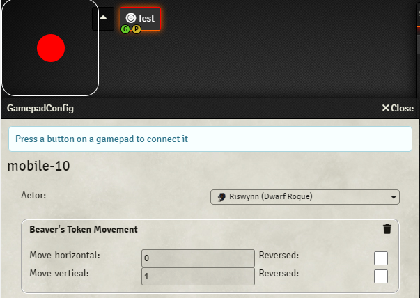
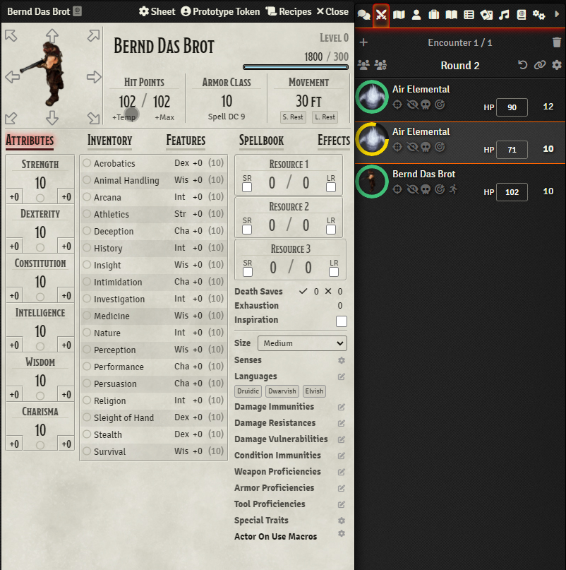
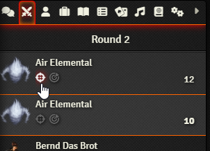

# Beaver's Mobile Enhancements

Beavers-mobile is a module to enhance playing locally with foundry on a map screen while players join with tablets.
The aim is that the players play on the screen while using their devices to interact.

I do not want a lan party so best would be if they do not have any canvas at all rendered on their devices.
The Map is shown on a table screen and that is the place where communication should happen.

## Features
- VirtualGamepad to control an actor
  - you can register a gamepad stick and then configure it using [beavers-gamepad](https://github.com/AngryBeaver/beavers-gamepad)

- Dnd5e slim mobile sheet 500px that works good on 90 degrees rotated tablets
  - token movement via sheet on click or touch on char-image and using it like a gamepad control-stick

- targeting without canvas

## Similar Modules
### Overall
[DDB-GameLog](https://github.com/IamWarHead/ddb-game-log)
- has a gamesheet that can interact with foundry.
- has limitations as you are not able to target and thus using automation modules or move. 
### Targeting
[midi-qol](https://gitlab.com/tposney/midi-qol)
- Can enable late targeting that would allow targeting without canvas but it is currently broken.
### Moving
[mobile-token-movement-controls](https://gitlab.com/MatthijsKok/mobile-token-movement/-/blob/main/scripts/mobile-token-movement-controls.js)
- Allow moving your token but not on char-sheet and collision is not detected correctly.

## Troubleshooting
### Disable canvas CoreSetting
Disable canvas will break mostly all interaction with tokens e.g. attacking,targeting etc. 
that is why this module comes with a hide canvas option.
### Black Screen on mobile devices
if you have a blackbox covering your screen or parts of it try to disable all 3d modules like dice so nice.
You need to disable them for the mobile devicecs if possible then you can turn it on again for the main screen.
### Messed up styles
it is not that good in combination with [mobile improvements](https://gitlab.com/fvtt-modules-lab/mobile-improvements)
which is a way better mobile module than mine but it just did not fit me.
### Can't login on mobile
Sometime mobile devices have problem when logging into foundry. The trick is do not hit enter after password. While the keyboard popup is still up press the login button. That at least helped me on some devices. 

## Modules you should consider to enable
### TouchVTT
This is the main module for mobile devices to make touch screens functional.
### MidiQol
This is a module to automate attack and damage. My suggestion is to use maximal automation with it so the user devices do not need to confirm any other popup.
Also when this issue is solved: https://gitlab.com/tposney/midi-qol/-/issues/1053. The gamemaster or map device should be able to draw the MeasuredTemplate for spells that require it.(as this module intent that the user device does not need canvas at all).

# Credits
project structure is copied from midi-qol (gulpfile,package.json,tsconcig.json)
