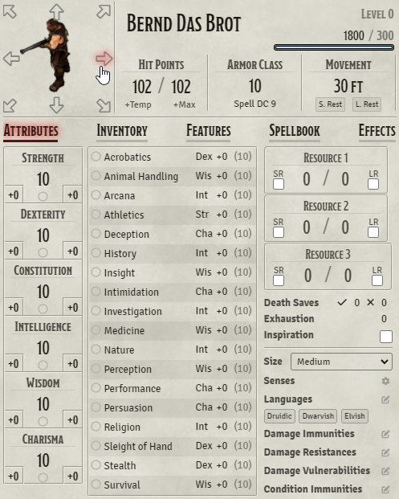

# Beaver's Mobile Enhancements

Beavers-mobile is a module to enhance playing locally with foundry on a map screen while players join with tablets.
The aim is that the players play on the screen while using their devices to interact.

I do not want a lan party so best would be if they do not have any canvas at all rendered on their devices.
The Map is shown on a table screen and that is the place where communication should happen.

## Features
- targeting without canvas 

- slim mobile sheet 500px that works good on 90 degrees rotated tablets
- token movement via sheet

## Similar Modules
### Overall
[DDB-GameLog](https://github.com/IamWarHead/ddb-game-log)
- has a gamesheet that can interact with foundry.
- has limitations as you are not able to target and thus using automation modules or move. 
### Targeting
[midi-qol](https://gitlab.com/tposney/midi-qol)
- Can enable late targeting that would allow targeting without canvas sadly it is currently broken.
### Moving
[mobile-token-movement-controls](https://gitlab.com/MatthijsKok/mobile-token-movement/-/blob/main/scripts/mobile-token-movement-controls.js)
- Allow moving your token but in combination with canvas.

## Note
CoreSetting: Disable canvas will break mostly all interaction with tokens e.g. attacking,targeting etc. 
that is why this module comes with a hide canvas option.

# Credits
project structure is copied from midi-qol (gulpfile,package.json,tsconcig.json)